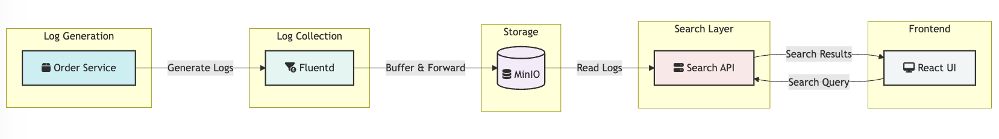
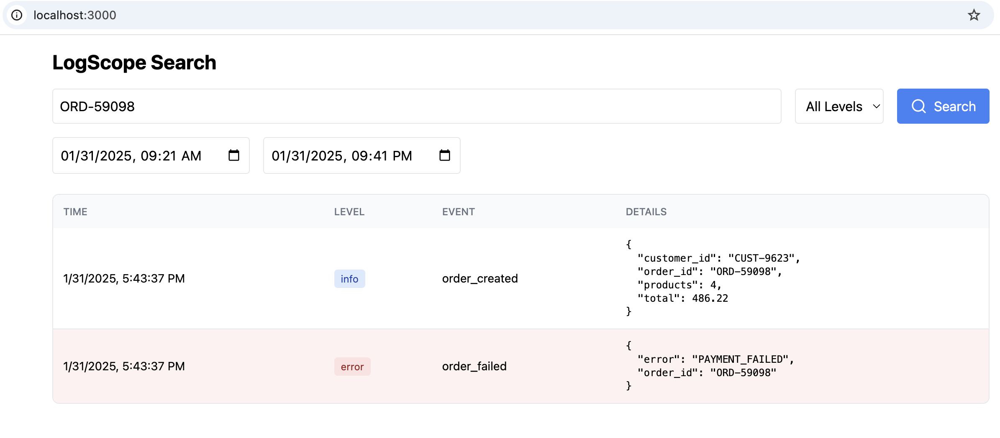

# Log Analytics

An end-to-end practical project that simulates production-like logging infrastructure, yet is free to set up in your local environment.
The Learning Opportunities are:
Setting up a  multi-container development environment using Docker Compose, enabling local testing and development without cloud dependencies
Testing different log patterns
Experimenting with log parsing
Trying different search strategies
Add alerts based on log patterns

## Architecture Diagram

## How to build and run locally

`docker-compose up --build`

After running the above command all the containers should boot up, and once all are up and running:

minIO is accessible here: http://localhost:9001;
username: minioadmin, 
password: minioadmin

Search UI is accessible here: http://localhost:3000/

